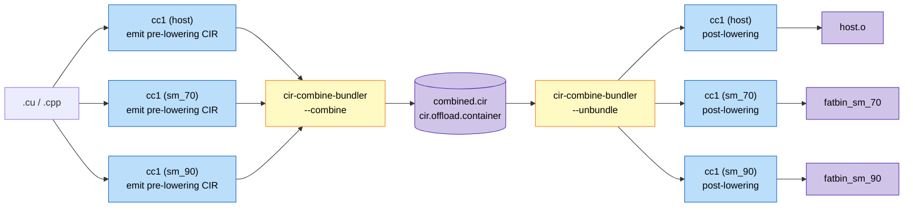

# GSoC 2026 — Unified Host/Device CIR for CUDA & HIP

This is a development fork of [llvm/llvm-project](https://github.com/llvm/llvm-project)
hosting the GSoC 2026 project **"Combine/Split CIR for CUDA & HIP offloading"**.

- **Mentors:** Konstantinos Parasyris, Joseph Huber
- **Contributor:** David Rivera ([@RiverDave](https://github.com/RiverDave))

## Background

LLVM's offload pipeline keeps host and device code separate until it's too late for
cross-boundary optimization. CIR Combine fixes this with a merge-optimize-split stage:
both modules are lowered to CIR, merged into a single heterogeneous translation unit,
optimized together (constant propagation across launch sites, dead kernel elimination,
launch dimensionality inference), then split back into their respective backend pipelines.

The intended flow looks like (We depict tool invocations in this context):

## Status

_Updated 2026-05-23._ Bootstrapping. RFC draft depicting intended
driver semantics in-progress bundler tool and new driver actions not yet committed.

